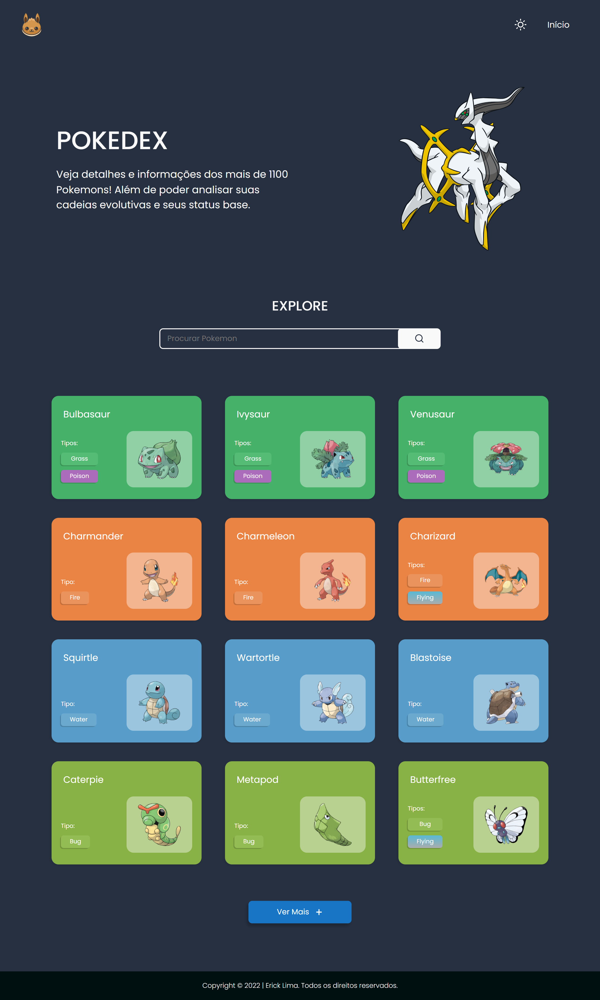
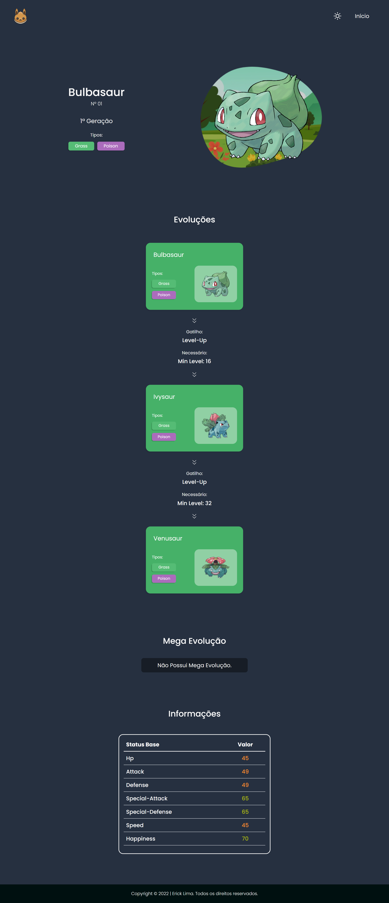

# Pokedex

### Ajustes e melhorias

O projeto ainda está em desenvolvimento e as próximas atualizações serão voltadas as seguintes tarefas:

- [x] Terminar Front-End
- [ ] Ajustes Front-End
- [ ] Otimização
- [ ] LazyLoad Module
- [ ] SEO